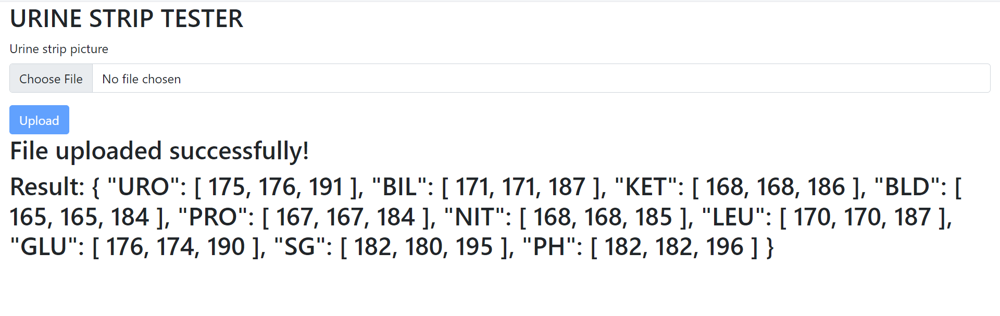

## Backend Developer Hiring Assignment - Urine Strip Color Identification

### Overview
This project is a web interface that allows users to upload an image of their urine strip and identify the colors on the strip. The application analyzes the uploaded image using OpenCV and returns the results as a JSON object containing RGB values for each of the 10 colors on the strip.

### Sample Images





### Features
- **Image Upload:** Users can upload an image of their urine strip through the web interface.
- **Color Identification:** The application analyzes the uploaded image to identify the colors on the urine strip.
- **JSON Output:** Results are returned as a JSON object containing RGB values for each of the 10 colors.

### Technology Stack
- **Backend Framework:** Django
- **Image Processing Library:** OpenCV

### Installation
1. Clone the repository from GitHub:
   ```
   git clone <repository_url>
   ```

2. Install Python dependencies:
   ```
   pip install -r requirements.txt
   ```

3. Start the Django development server:
   ```
   python manage.py runserver
   ```

4. Access the web interface in your browser at `http://127.0.0.1:8000`.

### Usage
1. Navigate to the web interface.
2. Upload an image of the urine strip.
3. After uploading the image, click the "Submit" button to submit it.
4. The application will process the image and return the color identification results as a JSON object.
